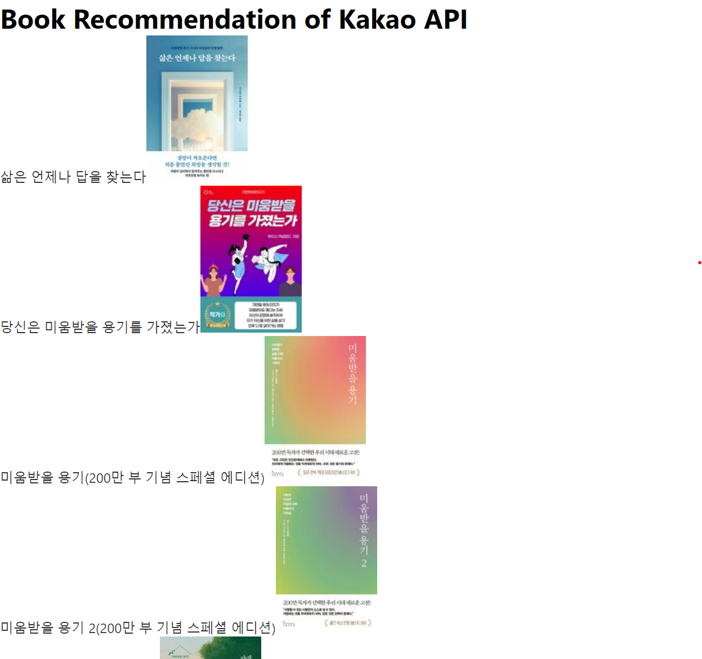
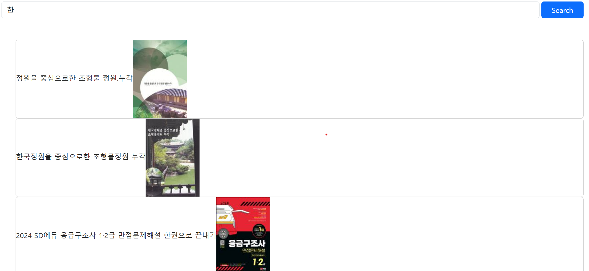
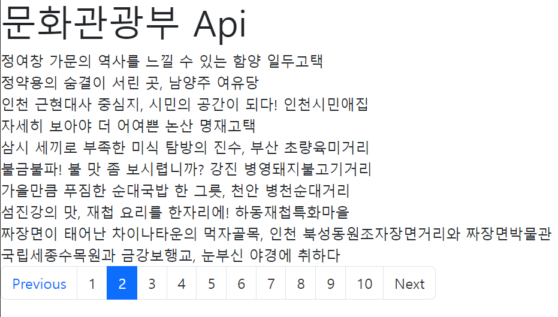

# 카카오 API & kcisa API & React

- 목록
- Kakao 검색 API
- Paging 구현

# 카카오 검색 API

https://developers.kakao.com/docs/latest/ko/daum-search/common

https://www.kcisa.kr/

# react 화면

- api 목록
  

- 검색
  

- Paging

